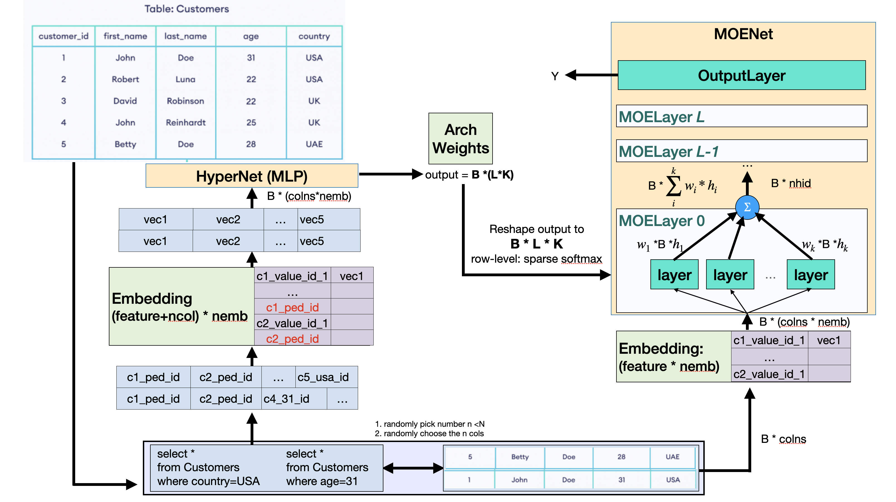

# SAMS: SQL Aware Model Slicing System


# Config Environments

```bash
# Create virtual env
conda config --set ssl_verify false
conda create -n "sams" python=3.6.13
conda activate sams

# Install
pip install -r requirements.txt  --trusted-host pypi.org --trusted-host files.pythonhosted.org
pip install  tqdm==4.47.0 --trusted-host pypi.org --trusted-host files.pythonhosted.org
pip install torch==1.8.1+cu111 torchvision==0.9.1+cu111 torchaudio==0.8.1 -f https://download.pytorch.org/whl/torch_stable.html --trusted-host pypi.org --trusted-host files.pythonhosted.org

# Init env
source init_env
```

# Run one job
```python
# Run on CPU
python main.py --device cpu --log_folder sams_logs --K 4 --moe_num_layers 4 --moe_hid_layer_len 10 --num_layers 4 --hid_layer_len 10 --data_nemb 10 --sql_nemb 10 --dropout 0.0 --alpha 1.7 --max_filter_col 4 --nfeat 369 --nfield 43 --epoch 3 --batch_size 128 --lr 0.002 --iter_per_epoch 10 --report_freq 30 --data_dir "./third_party/data/" --dataset uci_diabetes --num_labels 1
# Run on GPU
python main.py --device cuda:0 --log_folder sams_logs --K 4 --moe_num_layers 4 --moe_hid_layer_len 10 --num_layers 4 --hid_layer_len 10 --data_nemb 10 --sql_nemb 10 --dropout 0.0 --alpha 1.7 --max_filter_col 4 --nfeat 369 --nfield 43 --epoch 100 --batch_size 1024 --lr 0.002 --iter_per_epoch 200 --report_freq 30 --data_dir "./third_party/data/" --dataset uci_diabetes --num_labels 1
```
## Command Line Arguments

-  `--device` : Specifies the device to run on. Default is `"cpu"` .
-  `--log_folder` : The name of the folder to store logs. Default is `"sams_logs"` .
-  `--log_name` : The name of the log file. Default is `"run_log"` .
-  `--K` : The number of duplication layers of each MOE layer. Default is `4` .
-  `--moe_num_layers` : The number of hidden MOE layers of MOENet. Default is `4` .
-  `--moe_hid_layer_len` : Hidden layer length in MoeLayer. Default is `10` .
-  `--num_layers` : The number of hidden layers of hyperNet. Default is `4` .
-  `--hid_layer_len` : Hidden layer length in hyerNet. Default is `10` .
-  `--data_nemb` : Embedding size. Default is `10` .
-  `--sql_nemb` : SQL embedding size. Default is `10` .
-  `--dropout` : Dropout rate. Default is `0.0` .
-  `--alpha` : The entmax alpha to control sparsity, Default is `1.7` .
-  `--max_filter_col` : The number of columns to choose in select...where... Default is `4` .
-  `--nfeat` : The number of features. Default is `369` .
-  `--nfield` : The number of fields. Default is `43` .
-  `--epoch` : The number of maximum epochs. Default is `3` .
-  `--batch_size` : Batch size. Default is `128` .
-  `--lr` : Learning rate. Default is `0.002` .
-  `--iter_per_epoch` : Iterations per epoch. Default is `10` .
-  `--report_freq` : Report frequency. Default is `30` .
-  `--data_dir` : Path of data and result parent folder. Default is `"./third_party/data/"` .
-  `--dataset` : The dataset to use. Default is `'uci_diabetes'` .
-  `--num_labels` : Number of labels. Default is `1` .

